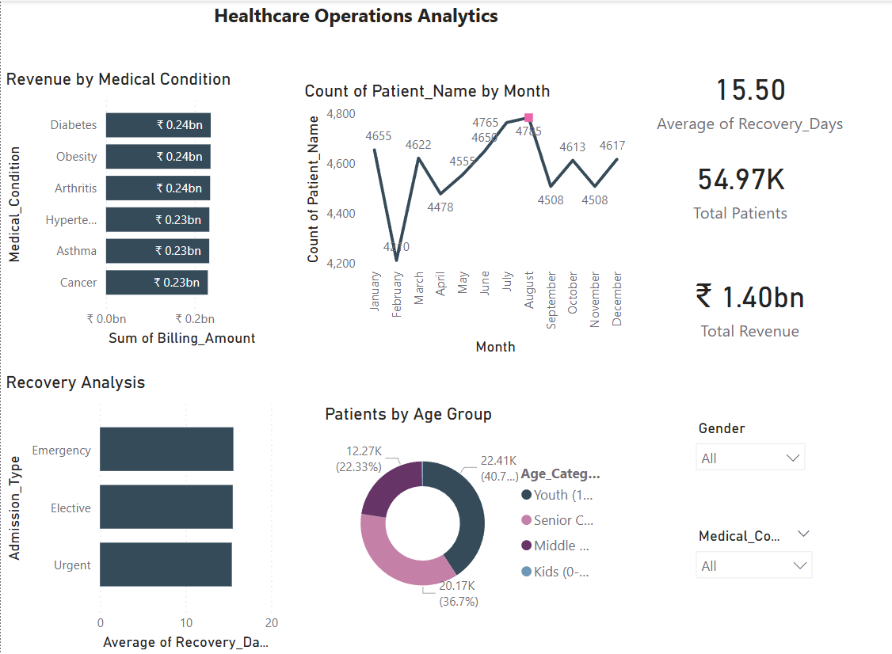

# Healthcare-Data-Analysis-PowerBI-SQL
An End-to-End Healthcare Data Analytics project using SQL and Power BI to analyze patient recovery speed, billing trends, and hospital operational efficiency
# Project Title
Healthcare Operations & Patient Insights Dashboard
# Problem Statement
To analyze Hospital efficiency  and billing trends 
# Tech Stack
SQL (Data Extraction), Power BI (Visualization), DAX (Calculations)

# Key Insights
.💰 Total Revenue: ₹1.40bn

. 📈 Peak Month: August (4,785 patients)

. ⏱️ Avg Recovery: 15.5 days

 
 
To explore this project on your local machine, follow these steps:

1. **Clone the Repository:** Download the project as a ZIP file or clone it using:
   `git clone https://github.com/pavan-123-annepu/Healthcare-Data-Analysis-PowerBI-SQL.git`

2. **Database Setup (SQL):**
   - Open your SQL environment (MySQL/PostgreSQL/SQL Server).
   - Import the `hospital Dataset.csv` file.
   - Run the queries provided in `SQL_Queries.sql` to see the data extraction logic.

3. **Power BI Dashboard:**
   - Install **Power BI Desktop** (if you don't have it).
   - Open the `Healthcare_Dashboard.pbix` file.
   - You can now interact with the slicers (Gender, Medical Condition) to see real-time insights!

